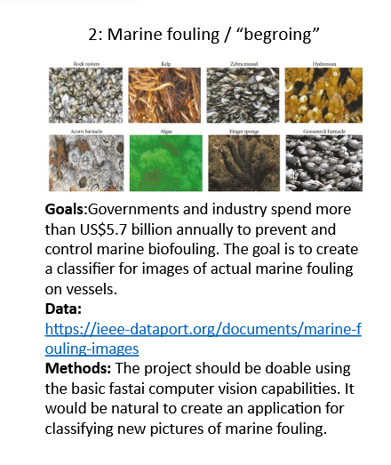

# DAT255_miniproject

Marine fouling application to classify images.
The images are fetched from DuckDuckGo using fastai lib methods.

For each validated image (keep), a prediction is made from a pretrained model alongside with the probability.
  

